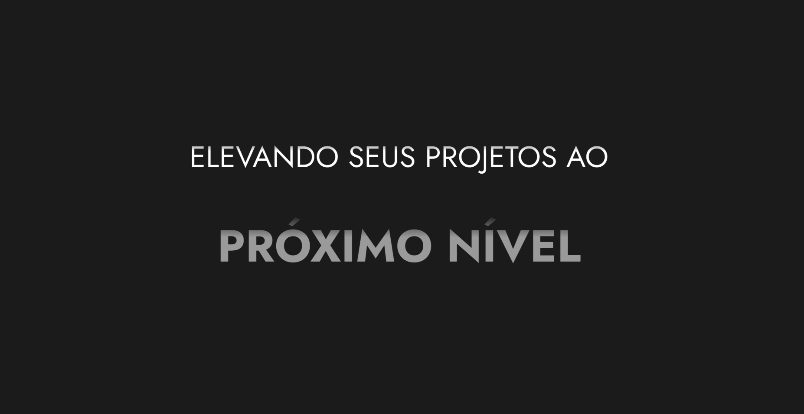

# Meu Portfólio em React

## Índice
- [Sobre o Projeto](#sobre-o-projeto)
- [Demonstração](#demonstração)
- [Tecnologias Utilizadas](#tecnologias-utilizadas)
- [Uso](#uso)
- [Contato](#contato)

## Sobre o Projeto
Este é o meu portfólio pessoal desenvolvido com React. Ele serve como uma vitrine dos meus projetos e habilidades como desenvolvedor. O objetivo é mostrar meu trabalho de forma organizada e atraente.

## Demonstração
Você pode acessar a versão ao vivo do meu portfólio [aqui](marcelo-couferai.vercel.app).

Demonstração do Projeto: 

## Tecnologias Utilizadas
- React
- CSS
- JavaScript
- AOS

## Uso
No meu portfólio, você encontrará:
- Uma seção sobre mim.
- Minhas experiências profissionais.
- Minhas experiências acadêmicas.
- Meus contatos e links para minhas redes sociais.

## Contato

E-mail - [mcouferai@gmail.com](mcouferai@gmail.com)

Linkedin - [linkedin.com/in/marcelo-couferai/](linkedin.com/in/marcelo-couferai/)